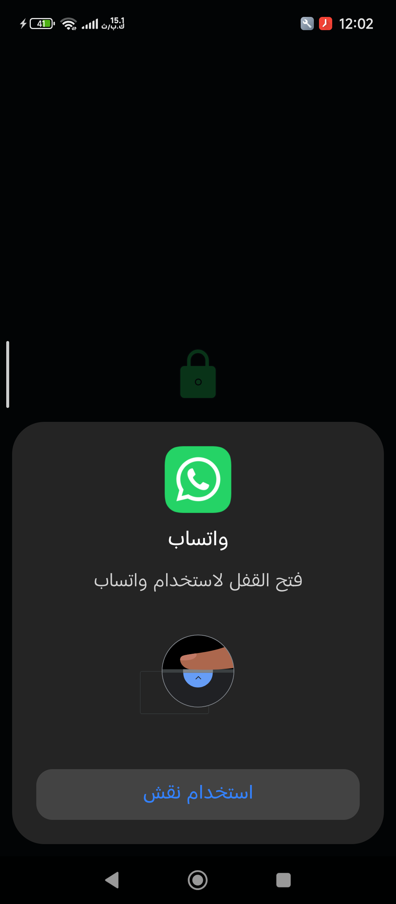

# لَعّيب

حوّل هاتفك الأندرويد إلى يد تحكم لاسلكية للحاسوب. افتح التطبيق، امسح رمز
QR من الخادم، والعب — بعصي تناظرية وأزرار واهتزاز ودعم الجيروسكوب.

## تحتاج أولًا: الخادم

التطبيق يحتاج خادم **منصة المتحكمات** يعمل على الحاسوب (نفس شبكة Wi-Fi).
حمّله من صفحة الإصدارات (`.deb` أو AppImage أو أرشيف):

**[إصدارات الخادم](https://github.com/Amr-Os/minassat-al-mutahakkamat/releases/latest)**

(زر **تحميل خادم الحاسوب** داخل التطبيق يأخذك لنفس الصفحة.)

## التوصيل

1. شغّل الخادم على الحاسوب واضغط **تشغيل الخادم** إن لم يكن يعمل.
2. في التطبيق افتح شاشة التوصيل: امسح رمز QR أو أدخل IP والمنفذ يدويًا.
3. عند نجاح الفحوصات ستنتقل لشاشة اليد مباشرة.

## المزايا

- أوضاع لعب متعددة وملفات مخصصة (أزرار، أحجام، أماكن، حساسية العصي).
- جيروسكوب للعصي، اهتزاز عند الضغط، ملء الشاشة.
- العربية افتراضيًا مع خيار English، والوضع الداكن دائمًا.
- فحص ذاتي قبل الاتصال (الشبكة، الـping، المنفذ) لمعرفة سبب الفشل بسرعة.

## حل المشاكل

- **لا يجد الخادم**: تأكد أن الهاتف والحاسوب على نفس الشبكة، وأن جدار
  الحماية يسمح بمنفذ الخادم.
- **انقطع أثناء اللعب**: أعد التوصيل — الخادم يحرر كل الأزرار تلقائيًا
  عند انقطاع الاتصال فلا يعلق أي زر.
- **تأخر الاستجابة**: قرّب الهاتف من الراوتر، أو قلّل فترة التحديث من
  الإعدادات (الافتراضي 80 مللي ثانية).

## الشكر والرخصة

مبني على عمل **kitswas** في
[VirtualGamePad-Mobile](https://github.com/kitswas/VirtualGamePad-Mobile)،
ويعمل مع خادم
[منصة المتحكمات](https://github.com/Amr-Os/minassat-al-mutahakkamat).
التطبيق الأصلي لـ kitswas يعمل أيضًا مع خادمنا (نفس البروتوكول).

GPL-3.0 — انظر [LICENCE.TXT](LICENCE.TXT).
